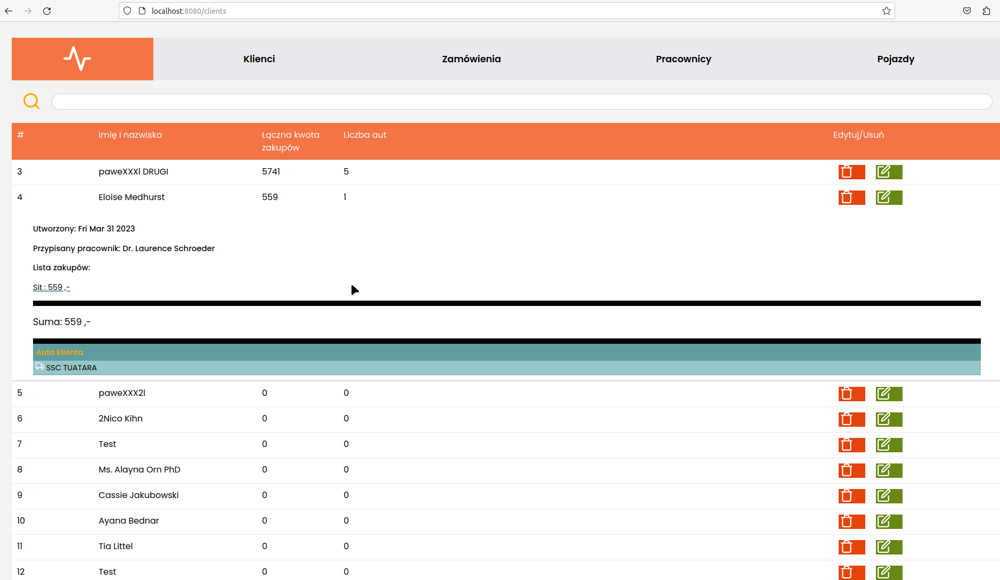

#### Warning: This app require database migration and SMTP/POP3/IMAP configuration


````
rename -> .example.env -> .env
then set database and email configuration
````

# Step 1:
## Use Factory
````
php artisan tinker
-> App\Models\Car::factory(20)->create();
-> App\Models\Employee::factory(20)->create();
-> App\Models\Client::factory(20)->create();
-> App\Models\Order::factory(20)->create();
````
---------------

# Step 2:
## Make test
### (You can skip Step1, test includes factory in setup)
````
php artisan test tests/CrudControllerTest.php
````
----------------
# Step 3:
## Use app
````
cd ./vue
$ npm run serve

cd ./laravel
$ php artisan serve
````
#### Then you will be able to run application directly on localhost:8000/
#### or through VUE and Laravel as API on localhost:8080/
